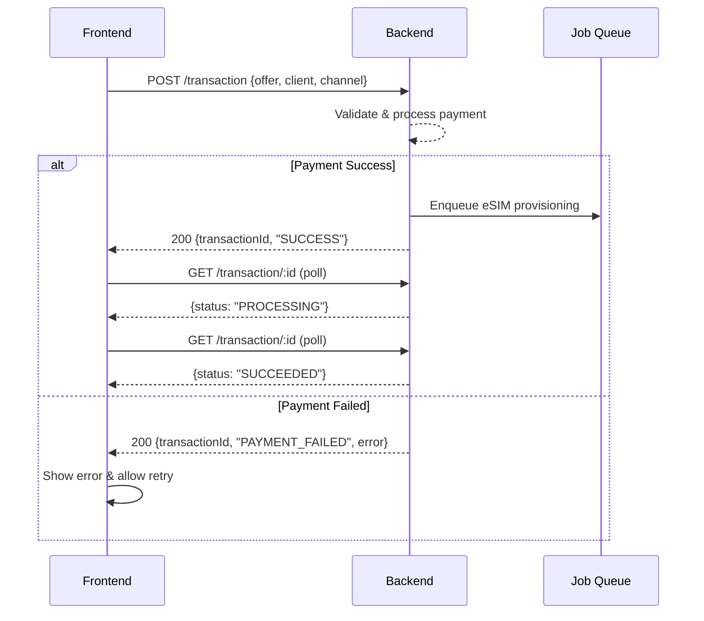

# Frontend eSIM Purchase & Payment Guide

## 1. Overview
- **Two channels:** B2C (client pays directly) and B2B2C (salesman pays via wallet)
- **Async processing:** After payment, eSIM provisioning happens in the background
- **Transaction tracking:** Every purchase returns a `transactionId` to poll status

## 2. Main Flow
1. Frontend fetches available offers.
2. User selects an offer and submits purchase with client details.
3. Backend processes payment (card for B2C, wallet for B2B2C).
4. Backend returns `transactionId` and status.
5. Frontend polls or listens for provisioning result.

## 3. API Endpoints

### Purchase eSIM (`POST /transaction`)
**Request:**
```json
{
  "passportId": "AB123456",
  "email": "client@example.com",
  "firstname": "Jane",
  "lastname": "Doe",
  "offerId": 1,
  "amount": 100,
  "currency": "TND",
  "channel": "B2C"
}
```
> For B2B2C, add `"channel": "B2B2C"` and `"paymentMethod": "WALLET"`.

**Success Response:**
```json
{
  "transactionId": 42,
  "message": "SUCCESS"
}
```
**Failure Response:**
```json
{
  "transactionId": 42,
  "message": "PAYMENT_FAILED",
  "error": "Card declined (insufficient funds or fraud)."
}
```

### Get Transaction Status (`GET /transaction/:id`)
**Response:**
```json
{
  "id": 42,
  "status": "PENDING | PROCESSING | SUCCEEDED | FAILED",
  "offerId": 1,
  "amount": 100,
  "currency": "TND",
  "channel": "B2C"
}
```

## 4. Possible `message` Values
| Message | Meaning |
|---|---|
| `SUCCESS` | Payment accepted, provisioning queued |
| `PAYMENT_FAILED` | Card/payment declined |
| `WALLET_FAILED` | Insufficient wallet balance (B2B2C) |
| `QUEUE_FAILED` | Internal error, retry later |

## 5. Token Usage
All endpoints require authentication. Attach the JWT token:
```json
{
  "Authorization": "Bearer eyJhbG..."
}
```

## 6. Error Handling
- **401 Unauthorized:** Token missing or expired → redirect to login.
- **403 Forbidden:** User lacks permission for this channel.
- **404 Not Found:** Offer or transaction does not exist.
- **400 Bad Request:** Missing or invalid fields in the request body.

## 7. Frontend Behavior
- **On `SUCCESS`:** Show "Processing…" spinner, poll `GET /transaction/:id` until `SUCCEEDED` or `FAILED`.
- **On `PAYMENT_FAILED`:** Show error message from response, allow retry.
- **On `WALLET_FAILED`:** Prompt salesman to top up wallet.
- **On `QUEUE_FAILED`:** Show generic error, suggest retrying later.

## 8. Sequence Diagram

