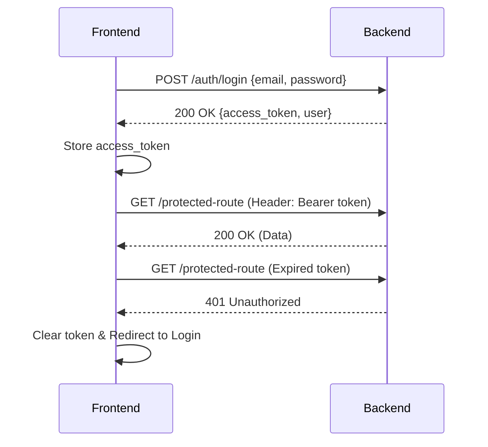

# Frontend Authentication Guide

## 1. Overview
- **Type:** JWT (JSON Web Token)
- **State:** Stateless (Token-based)
- **Format:** Bearer Token

## 2. Main Flow
1. User submits credentials to `/auth/login` or `/auth/signup`.
2. Backend returns an `access_token` and user data.
3. Frontend stores the `access_token` securely.
4. Frontend attaches the token to the `Authorization` header for all protected API requests.
5. On token expiration (401 error), frontend redirects to login.

## 3. API Endpoints

### Sign Up (`POST /auth/signup`)
**Request:**
```json
{
  "email": "user@example.com",
  "password": "securepassword123",
  "name": "Jane Doe"
}
```
**Response:**
```json
{
  "access_token": "eyJhbG...",
  "user": {
    "id": "123",
    "email": "user@example.com",
    "name": "Jane Doe"
  }
}
```

### Login (`POST /auth/login`)
**Request:**
```json
{
  "email": "user@example.com",
  "password": "securepassword123"
}
```
**Response:**
```json
{
  "access_token": "eyJhbG...",
  "user": {
    "id": "123",
    "email": "user@example.com"
  }
}
```

## 4. Token Usage
Store the `access_token` in `localStorage` or `sessionStorage`.
Attach to every request header:
```json
{
  "Authorization": "Bearer eyJhbG..."
}
```

## 5. Protected Routes
Example — fetch user profile:
`GET /users/profile` (Requires `Authorization` header)

## 6. Error Handling
- **401 Unauthorized:** Token is missing, invalid, or expired.
- **403 Forbidden:** Token valid, but user lacks permission.

## 7. Frontend Behavior
- **On Signup/Login:** Store token, redirect to dashboard.
- **On Logout:** Remove token, redirect to login page.
- **On 401 Error:** Clear token, prompt user to log in again.

## 8. Sequence Diagram

