# NetyFly eSIM — Diagrammes UML
> Format : Mermaid (rendu dans VS Code, GitHub, Notion…)  
> Auteur : Behij Gharbi | 2026-05-23

---

## TABLE DES MATIÈRES
1. [Diagramme de Classes — Domaine (Entités Prisma)](#1-diagramme-de-classes--domaine)
2. [Diagramme de Classes — Couche BCE](#2-diagramme-de-classes--couche-bce)
3. [Séquence BCE — Achat eSIM B2C (paiement carte)](#3-séquence-bce--achat-esim-b2c)
4. [Séquence BCE — Achat eSIM B2B2C (wallet revendeur)](#4-séquence-bce--achat-esim-b2b2c)
5. [Séquence BCE — Recharge Wallet (Top-Up revendeur)](#5-séquence-bce--recharge-wallet)
6. [Séquence BCE — Recharge Données eSIM (Topup eSIM)](#6-séquence-bce--recharge-données-esim)
7. [Séquence BCE — Authentification (Login + Refresh)](#7-séquence-bce--authentification)
8. [Séquence BCE — Réconciliation Paiements (Scheduler)](#8-séquence-bce--réconciliation)

---

## 1. Diagramme de Classes — Domaine

```mermaid
classDiagram

  %% ─── ENUMS ────────────────────────────────────────────────
  class Role {\chapter{Identification de l'environnement}

% ─────────────────────────────────────────────────────────────────────────────
\section*{Introduction}
\addcontentsline{toc}{section}{Introduction}
% ─────────────────────────────────────────────────────────────────────────────

Ce chapitre présente l'environnement dans lequel la plateforme NetyFly a été
conçue et développée. Il identifie les acteurs du système et leurs interactions
à travers les diagrammes de cas d'utilisation et de classes, puis expose les
choix technologiques retenus en justifiant chaque décision par des critères
techniques précis.

% ─────────────────────────────────────────────────────────────────────────────
\section{Environnement applicatif}
% ─────────────────────────────────────────────────────────────────────────────

\subsection{Acteurs du système}

La plateforme NetyFly implique deux acteurs principaux, chacun disposant d'un
espace dédié avec des fonctionnalités adaptées à son profil~:

\begin{itemize}
  \item \textbf{Client (B2C)~:} voyageur tunisien interagissant directement
    avec l'application mobile. Il peut s'inscrire, parcourir le catalogue
    d'offres eSIM, sélectionner une destination, effectuer un paiement via
    ClicToPay, activer son eSIM par QR code, suivre sa consommation en temps
    réel et recharger son forfait.
  \item \textbf{Vendeur (B2B)~:} commercial appartenant au réseau de
    distribution Nety. Il accède à un portail dédié via des identifiants
    fournis par l'entreprise. Il peut vendre des eSIM à des clients en
    présentiel, activer l'eSIM pour leur compte, gérer son portefeuille,
    recharger son solde et consulter l'historique de ses transactions.
\end{itemize}

\subsection{Diagramme de cas d'utilisation global}

Le diagramme de cas d'utilisation global illustre l'ensemble des interactions
entre les deux acteurs du système et la plateforme NetyFly. Il met en évidence
la séparation claire entre l'espace client et l'espace vendeur, ainsi que les
dépendances entre les cas d'utilisation via les relations d'inclusion.

\begin{figure}[H]
  \centering
  \includegraphics[width=0.75\textwidth]{chapters/images/usecase (2).png}
  \caption{Diagramme de cas d'utilisation global de NetyFly}
  \label{fig:use_case_global}
\end{figure}

Le parcours client suit une séquence logique~: la sélection de la destination
inclut le choix du pack, qui inclut à son tour le paiement, lequel déclenche
automatiquement l'activation de l'eSIM. Du côté vendeur, la vente d'une eSIM
inclut systématiquement son activation pour le client ainsi que la gestion
du portefeuille associé.

\subsection{Diagramme de classes global}

Le diagramme de classes global représente la structure des données de la
plateforme NetyFly, telle qu'elle est définie dans le schéma Prisma. Il
illustre les entités principales, leurs attributs et les relations qui les
unissent.

\begin{figure}[H]
  \centering
  \includegraphics[width=\textwidth]{chapters/images/DigClass.png}
  \caption{Diagramme de classes global de NetyFly}
  \label{fig:class_diagram}
\end{figure}

L'entité \textbf{User} est au centre du modèle~: elle est liée aux
transactions, aux eSIM activées, au portefeuille et aux logs d'audit.
L'\textbf{Offer} représente les packs eSIM disponibles dans le catalogue.
La \textbf{Transaction} orchestre le flux d'achat en reliant l'offre choisie
au paiement et à l'eSIM générée. Le \textbf{Wallet} et les
\textbf{WalletTransaction} supportent le modèle B2B avec un système de
comptabilité en double entrée. L'\textbf{AuditLog} assure la traçabilité
complète des opérations de la plateforme.

% ─────────────────────────────────────────────────────────────────────────────
\section{Environnement technique}
% ─────────────────────────────────────────────────────────────────────────────

\subsection{Choix technologiques}

Les technologies retenues pour le développement de NetyFly ont été
sélectionnées sur la base de critères techniques précis~: cohérence de
l'écosystème, adéquation aux contraintes métier et maîtrise de l'équipe.
Le tableau suivant présente chaque choix technologique en regard des
alternatives écartées et justifie la décision adoptée.

\begin{table}[H]
  \centering
  \caption{Tableau comparatif des choix technologiques}
  \label{tab:techstack}
  \renewcommand{\arraystretch}{1.4}
  \begin{tabularx}{\textwidth}{
    |>{\columncolor{rowlightblue}\bfseries\raggedright\arraybackslash}p{2.8cm}
    |>{\raggedright\arraybackslash}p{2.2cm}
    |>{\raggedright\arraybackslash}p{2.8cm}
    |X|}
    \hline
    \rowcolor{headerblue}
    \color{white}\textbf{Technologie} &
    \color{white}\textbf{Retenue} &
    \color{white}\textbf{Alternatives} &
    \color{white}\textbf{Justification} \\
    \hline
    Backend framework &
    NestJS &
    Express, Fastify &
    NestJS fournit une architecture modulaire avec injection de dépendances
    native et un support TypeScript cohérent entre les couches applicatives. \\
    \hline
    Frontend mobile &
    React Native Expo &
    Flutter, Ionic &
    Expo simplifie le développement cross-platform et s'intègre naturellement
    avec l'écosystème React et TypeScript déjà maîtrisé. \\
    \hline
    Base de données &
    PostgreSQL &
    MongoDB, MySQL &
    PostgreSQL garantit les propriétés ACID nécessaires aux transactions
    financières et à la cohérence des données. \\
    \hline
    Cache \& Queue &
    Redis &
    Memcached, RabbitMQ &
    Redis permet la gestion des clés d'idempotence ainsi que la persistance
    des jobs BullMQ. \\
    \hline
    File de messages &
    BullMQ &
    Kafka, RabbitMQ &
    BullMQ s'intègre nativement avec NestJS et fournit retry, backoff
    exponentiel et gestion des échecs. \\
    \hline
    ORM &
    Prisma &
    TypeORM, Sequelize &
    Prisma génère automatiquement les types TypeScript depuis le schéma de
    données et simplifie les migrations. \\
    \hline
    Temps réel &
    Socket.IO &
    WebSocket natif, SSE &
    Socket.IO facilite la communication temps réel avec reconnexion automatique
    et compatibilité multiplateforme. \\
    \hline
    Paiement &
    ClicToPay &
    Stripe, PayPal &
    ClicToPay permet le paiement en dinar tunisien, indispensable pour
    le marché local tunisien. \\
    \hline
  \end{tabularx}
\end{table}

% ─────────────────────────────────────────────────────────────────────────────
\section*{Conclusion}
\addcontentsline{toc}{section}{Conclusion}
% ─────────────────────────────────────────────────────────────────────────────

Ce chapitre a présenté l'environnement complet de la plateforme NetyFly.
Les acteurs du système ont été identifiés et leurs interactions modélisées
à travers les diagrammes de cas d'utilisation et de classes. Les choix
technologiques ont été justifiés par des critères techniques précis, en
cohérence avec les contraintes métier du projet. Le chapitre suivant présente
le premier sprint de développement, couvrant l'authentification et le
catalogue d'offres eSIM.
    <<enumeration>>
    ADMIN
    ZONE_CHIEF
    CLIENT
    SALESMAN
  }

  class TransactionStatus {
    <<enumeration>>
    PENDING
    PENDING_PAYMENT
    PROCESSING
    PAID
    PROVISIONING
    COMPLETED
    FAILED
    REFUNDED
    EXPIRED
  }

  class EsimStatus {
    <<enumeration>>
    NOT_ACTIVE
    ACTIVE
    PROCESSING
    PENDING
    FAILED
    EXPIRED
    DELETED
  }

  class WalletStatus {
    <<enumeration>>
    RESERVED
    COMMITTED
    RELEASED
  }

  class TopUpStatus {
    <<enumeration>>
    PENDING
    PENDING_PAYMENT
    PENDING_CASH
    APPROVED
    CREDITED
    REJECTED
    FAILED
  }

  class CoverageType {
    <<enumeration>>
    LOCAL
    REGIONAL
    GLOBAL
  }

  %% ─── ENTITÉS ──────────────────────────────────────────────
  class User {
    +Int id
    +String firstname
    +String lastname
    +String email
    +String hashedPassword
    +String? hashedRefreshToken
    +Float balance
    +UserStatus status
    +Role role
    +String? phone
    +String? pushToken
    +Boolean isDeleted
    +DateTime createdAt
    +DateTime updatedAt
  }

  class Offer {
    +Int id
    +String country
    +String countryCode
    +String Region
    +String Destination
    +String Category
    +String title
    +String? description
    +Int popularity
    +CoverageType coverageType
    +String networkType
    +Int dataVolume
    +Int validityDays
    +Float price
    +Float InternalMargin
    +Int providerId
    +Boolean isDeleted
    +DateTime createdAt
  }

  class Transaction {
    +String id
    +TransactionStatus status
    +TransactionType type
    +TransactionChannel channel
    +Float amount
    +String currency
    +Int userId
    +Int offerId
    +DateTime createdAt
    +DateTime updatedAt
  }

  class Esim {
    +String id
    +String iccid
    +String activationCode
    +EsimStatus status
    +String? qrCode
    +Int? dataTotal
    +Int? dataUsed
    +DateTime? lastUsageSync
    +DateTime? expiryDate
    +Int userId
    +String transactionId
    +Int offerId
    +Int providerId
    +DateTime? activatedAt
    +DateTime createdAt
  }

  class Payment {
    +String id
    +String paymentProvider
    +String gatewayPaymentId
    +Float amount
    +TransactionStatus status
    +Json? rawResponse
    +String? paymentUrl
    +Int userId
    +String transactionId
    +DateTime createdAt
  }

  class WalletTransaction {
    +String id
    +Float amount
    +Float balanceAfter
    +String paymentMethod
    +WalletStatus status
    +Int userId
    +String? transactionId
    +DateTime createdAt
  }

  class WalletLedger {
    +String id
    +Float amount
    +LedgerType type
    +LedgerReason reason
    +String referenceId
    +String walletId
    +DateTime createdAt
  }

  class TopUpRequest {
    +Int id
    +Float amount
    +String currency
    +String paymentMethod
    +TopUpStatus status
    +String? gatewayPaymentId
    +String? paymentUrl
    +String? failureReason
    +Int salesmanId
    +Int? reviewedBy
    +DateTime createdAt
  }

  class ActivationAttempt {
    +String id
    +Int attemptNumber
    +ActivationAttemptStatus status
    +String providerRequestId
    +Json providerResponse
    +String? errorCode
    +String? errorMessage
    +DateTime startedAt
    +DateTime? completedAt
    +String esimId
  }

  class AuditLog {
    +String id
    +AuditLayer layer
    +SystemEvent event
    +Int? userId
    +String? transactionId
    +AuditTrigger trigger
    +String? fromStatus
    +String? toStatus
    +Int? durationMs
    +Int? providerLatencyMs
    +Json? details
    +DateTime createdAt
  }

  class Provider {
    +Int id
    +String name
    +String? apiUrl
    +String? apiKey
    +DateTime createdAt
  }

  class Usage {
    +String id
    +Int remainingData
    +DateTime recordedAt
    +String esimId
  }

  %% ─── RELATIONS ────────────────────────────────────────────
  User "1" --> "0..*" Transaction : crée
  User "1" --> "0..*" Esim : possède
  User "1" --> "0..*" Payment : initie
  User "1" --> "0..*" WalletTransaction : détient
  User "1" --> "0..*" TopUpRequest : demande (salesman)

  Offer "1" --> "0..*" Transaction : est acheté via
  Offer "1" --> "0..*" Esim : est associé à
  Offer "1" --> "1" Provider : fourni par

  Transaction "1" --> "0..1" Esim : provisionne
  Transaction "1" --> "0..1" Payment : est payé via
  Transaction "1" --> "0..1" WalletTransaction : débite
  Transaction "1" --> "0..*" AuditLog : journalise

  Esim "1" --> "0..*" ActivationAttempt : tente activation
  Esim "1" --> "0..*" Usage : enregistre usage
  Esim "1" --> "1" Provider : géré par

  WalletTransaction "1" --> "0..*" WalletLedger : contient entrées
```

---

## 2. Diagramme de Classes — Couche BCE

```mermaid
classDiagram

  %% ─── BOUNDARY (Contrôleurs) ───────────────────────────────
  class AuthController {
    <<Boundary>>
    +login(dto, res) Response
    +signup(dto, res) Response
    +getMe(req) UserProfileDto
    +logout(req, res) void
    +refresh(req, body, res) Response
  }

  class TransactionController {
    <<Boundary>>
    +purchaseB2C(dto, req) TransactionResponseDto
    +getMine(req) Transaction[]
    +getById(req, id) TransactionDetailDto
    +requestRefund(req, id) void
  }

  class PaymentController {
    <<Boundary>>
    +create(dto, transactionId, req) PaymentResponseDto
    +verifyPayment(transactionId, req) VerifyResultDto
    +verifyAndProcess(dto) StatusDto
    +redirectSuccess(orderId) Redirect
    +redirectFail(orderId) Redirect
  }

  class EsimController {
    <<Boundary>>
    +getDestinations() DestinationDto[]
    +getUserEsims(req) EsimListResponseDto
    +getEsimById(id, req) EsimResponseDto
    +syncUsage(id) void
    +initiateTopup(id, dto, req) TopupResponseDto
    +deleteEsim(id, req) MessageDto
  }

  class WalletController {
    <<Boundary>>
    +getBalance(req) BalanceDto
    +getWalletHistory(req, page, limit) WalletHistoryDto
    +requestTopUp(req, dto) TopUpResponseDto
    +getPendingTopUps(page, limit) TopUpRequest[]
    +approveTopUp(req, dto) void
    +rejectTopUp(req, dto) void
  }

  class TopUpController {
    <<Boundary>>
    +initiateTopUp(dto, req) TopUpResponseDto
    +confirmCash(topUpRequestId, req) void
  }

  class OfferController {
    <<Boundary>>
    +create(dto) Offer
    +findAll(country, region, coverageType) Offer[]
    +findPopular() Offer[]
    +search(q) Offer[]
    +findDestinations() DestinationDto[]
    +findbyId(id) Offer
  }

  class UserController {
    <<Boundary>>
    +create(dto) UserDto
    +getProfile(req) ProfileResponseDto
    +updateProfile(dto, req) ProfileResponseDto
    +changePassword(dto, req) MessageDto
    +updatePushToken(body, req) void
  }

  %% ─── CONTROL (Services & Orchestrateurs) ─────────────────
  class EsimPurchaseOrchestrator {
    <<Control>>
    +purchaseEsim(dto, salesmanId) TransactionResponseDto
    -resolveClient(dto) User
  }

  class EsimTopupOrchestrator {
    <<Control>>
    +topupEsim(esimId, dto, userId) TopupResponseDto
    +handlePaidTopup(transactionId, userId) void
    +isTopupPayment(rawResponse) boolean
    +getTopupOffers(esimId, userId) Offer[]
    -executeTopupNow(params) void
  }

  class TopUpOrchestrator {
    <<Control>>
    +initiateTopUp(dto, salesmanId) TopUpResponseDto
    +confirmCash(topUpRequestId, zoneChiefId) void
    +handleGatewayConfirmed(gatewayPaymentId) void
    +handleGatewayFailed(gatewayPaymentId, reason) void
    +transition(topUpRequestId, target, triggeredBy) void
  }

  class FundingService {
    <<Control>>
    +execute(source, dto, transactionId, userId, salesmanId) FundingResult
    +releaseWalletFunds(transactionId) void
    -fundViaGateway(...) FundingResult
    -fundViaWallet(...) FundingResult
  }

  class TransactionService {
    <<Control>>
    +createInitial(dto, userId) Transaction
    +transition(id, next, source, correlationId) Transaction
    +requestRefund(transactionId, userId) void
    +findOne(transactionId) Transaction
    +getUserTransactions(userId) Transaction[]
    +getTransactionDetail(userId, transactionId) TransactionDetailDto
    -assertValidTransition(current, next) void
  }

  class PaymentService {
    <<Control>>
    +initiatePayment(transaction) PaymentInitDto
    +verifyPayment(transactionId) VerifyResultDto
    +verifyAndProcess(orderId) StatusDto
    -mapVerificationResult(result, transactionId) VerifyResultDto
  }

  class WalletService {
    <<Control>>
    +ReserveAmount(userId, transactionId, amount, paymentMethod) WalletTransaction
    +releaseReservedFunds(transactionId) void
    +commitReservedFunds(transactionId) void
    +getBalance(userId) BalanceDto
    +getWalletHistory(userId, page, limit) WalletHistoryDto
    +approveTopUp(topUpId, zonechiefId) void
    +rejectTopUp(topUpId, zonechiefId) void
  }

  class EsimService {
    <<Control>>
    +getUserEsims(userId) EsimListResponseDto
    +getEsimById(userId, esimId) EsimResponseDto
    +syncUsage(esimId) void
    +markActive(id) Esim
    +markFailed(id) Esim
    +requestActivation(esimId, params) Esim
    +markActivationSuccess(esimId, params) Esim
    +markActivationFailure(esimId, params) Esim
    +deleteEsim(userId, esimId) MessageDto
  }

  class ReconciliationService {
    <<Control>>
    +reconcileStalePayments() void
    +notifyUpcomingExpiry() void
    -expireAbandonedTransactions() void
  }

  class AuditLogService {
    <<Control>>
    +log(data) AuditLog
    +logtx(tx, data) AuditLog
    -triggerNotification(data) void
  }

  class NotificationService {
    <<Control>>
    +notifyUser(userId, template, data) void
    +sendPushOnly(userId, title, body) void
    -sendEmail(to, subject, html, text) void
    -sendPush(pushToken, title, body) void
  }

  class EsimProducer {
    <<Control>>
    +enqueuePurchase(data) Job
    +enqueueActivation(data) Job
    +enqueueTopup(data) Job
  }

  class EsimProcessor {
    <<Control>>
    +process(job) any
    +onCompleted(job) void
    +onFailed(job, err) void
  }

  %% ─── ENTITY (Repositories) ────────────────────────────────
  class TransactionRepository {
    <<Entity>>
    +createInitial(data) Transaction
    +updateStatus(id, status) Transaction
    +findOne(id) Transaction
    +findManyForUser(userId) Transaction[]
    +findWithRelations(id) Transaction
    +applyRefundStatuses(paymentId, transactionId, esimId) void
  }

  class EsimRepository {
    <<Entity>>
    +create(data) Esim
    +findById(id) Esim
    +updateStatus(id, status) Esim
    +findByUserId(userId) Esim[]
    +updateUsage(id, dataUsed) Esim
    +softDelete(id) Esim
    +aggregateDestinationsByCountryAndCoverageType() DestinationAggr[]
  }

  class PaymentRepository {
    <<Entity>>
    +initiatePayment(transaction) PaymentInitDto
    +checkPaymentStatus(gatewayOrderId) StatusDto
    +reversePayment(gatewayOrderId) boolean
    +findByGatewayPaymentId(id) Payment
    +findStalePayments(olderThanMs) Payment[]
  }

  class WalletRepository {
    <<Entity>>
    +ReserveAmount(userId, transactionId, amount, paymentMethod) WalletTransaction
    +commitReservedFunds(transactionId) void
    +releaseReservedFunds(transactionId) void
    +getBalance(userId) Float
    +approveTopUp(topUpId, adminId) void
  }

  class ClicToPayService {
    <<Entity>>
    +registerOrder(params) ClicToPayRegisterResponse
    +getOrderStatus(orderId) ClicToPayOrderStatus
    +reverseOrder(orderId) ClicToPayErrorResponse
    +refundOrder(orderId, amount) ClicToPayErrorResponse
  }

  %% ─── RELATIONS BCE ────────────────────────────────────────
  TransactionController --> EsimPurchaseOrchestrator : purchaseB2C
  TransactionController --> TransactionService : getMine / getById

  EsimPurchaseOrchestrator --> TransactionService : createInitial / transition
  EsimPurchaseOrchestrator --> FundingService : execute
  EsimPurchaseOrchestrator --> EsimProducer : enqueuePurchase

  FundingService --> PaymentService : fundViaGateway
  FundingService --> WalletService : fundViaWallet

  PaymentController --> PaymentService : verify / verifyAndProcess
  PaymentService --> PaymentRepository : initiatePayment / checkStatus
  PaymentRepository --> ClicToPayService : registerOrder / getOrderStatus

  EsimController --> EsimService : CRUD + sync
  EsimProcessor --> EsimService : markActive / markFailed
  EsimProcessor --> AuditLogService : log

  WalletController --> WalletService : balance / history / topup
  WalletService --> WalletRepository : CRUD ledger

  ReconciliationService --> PaymentRepository : findStalePayments
  ReconciliationService --> TransactionService : transition
  ReconciliationService --> NotificationService : notifyUser

  AuditLogService --> NotificationService : triggerNotification
```

---

## 3. Séquence BCE — Achat eSIM B2C

> **Acteur :** Client (CUSTOMER)  
> **Scénario :** Achat carte via ClicToPay → provisioning eSIM asynchrone

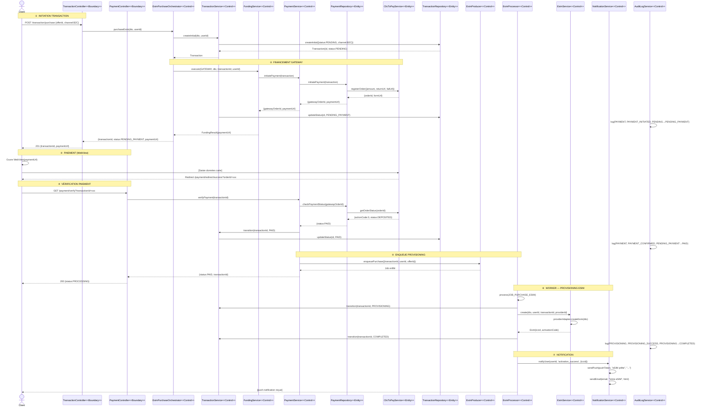

---

## 4. Séquence BCE — Achat eSIM B2B2C

> **Acteur :** Revendeur (SALESMAN)  
> **Scénario :** Vente eSIM à un client via débit wallet → provisioning immédiat

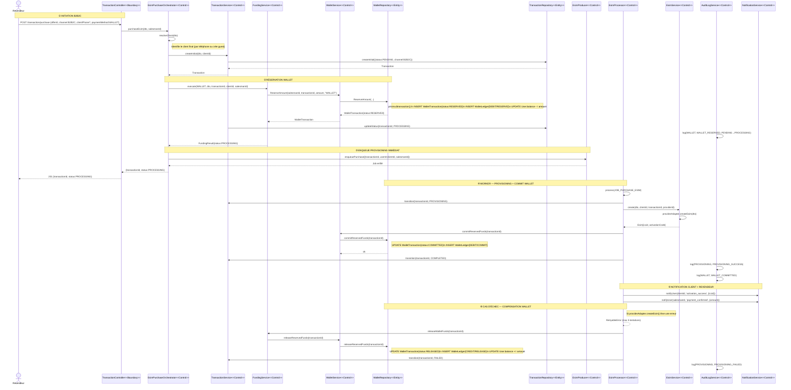

---

## 5. Séquence BCE — Recharge Wallet (Top-Up Revendeur)

> **Acteur :** Revendeur (SALESMAN), Zone Chief (ZONE_CHIEF)  
> **Scénario :** Recharge par carte (CARD) via ClicToPay

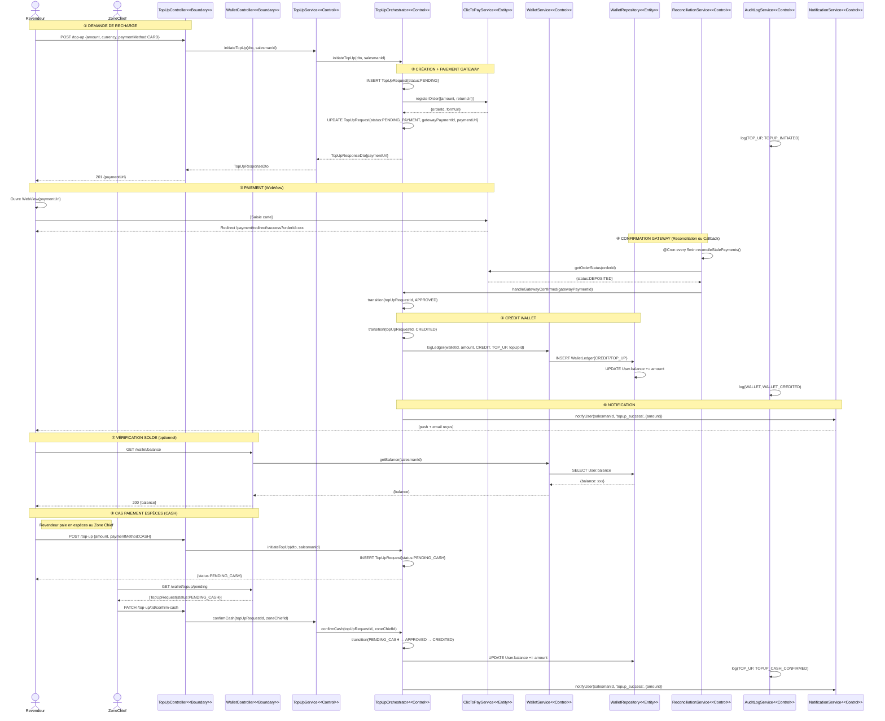

---

## 6. Séquence BCE — Recharge Données eSIM (Topup eSIM)

> **Acteur :** Client (CUSTOMER) ou Revendeur (SALESMAN)  
> **Scénario :** Ajout de données sur un eSIM existant (B2C carte)

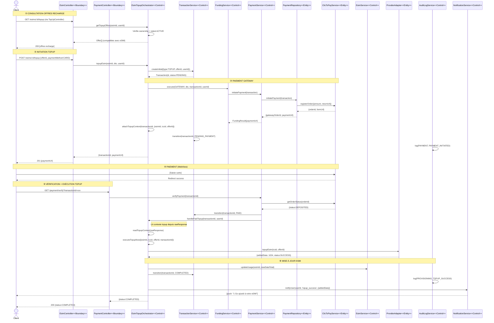

---

## 7. Séquence BCE — Authentification

> **Acteur :** Utilisateur (CLIENT / SALESMAN)  
> **Scénarios :** Login, Logout, Refresh token

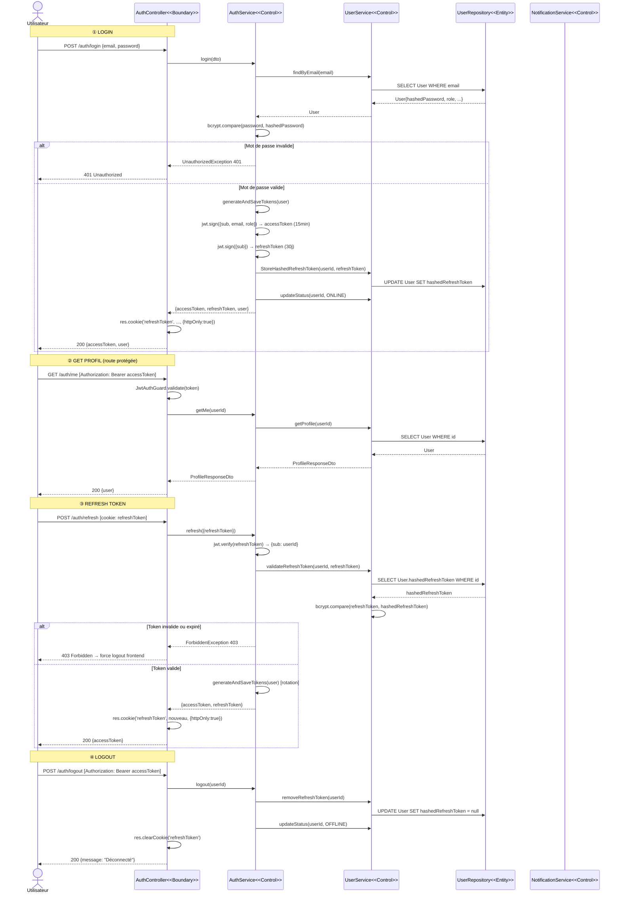

---

## 8. Séquence BCE — Réconciliation Paiements

> **Acteur :** Système (Scheduler CRON)  
> **Scénario :** Vérification périodique des paiements bloqués et des eSIMs bientôt expirées

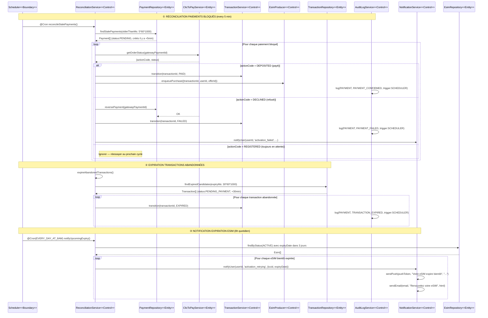

---

## MACHINES D'ÉTAT — Récapitulatif

### Transaction State Machine
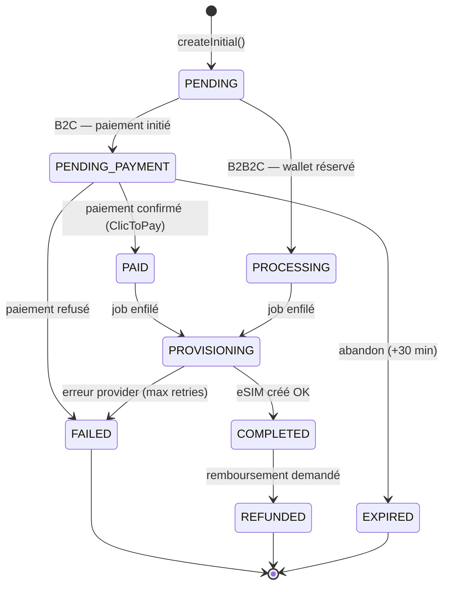

### eSIM State Machine
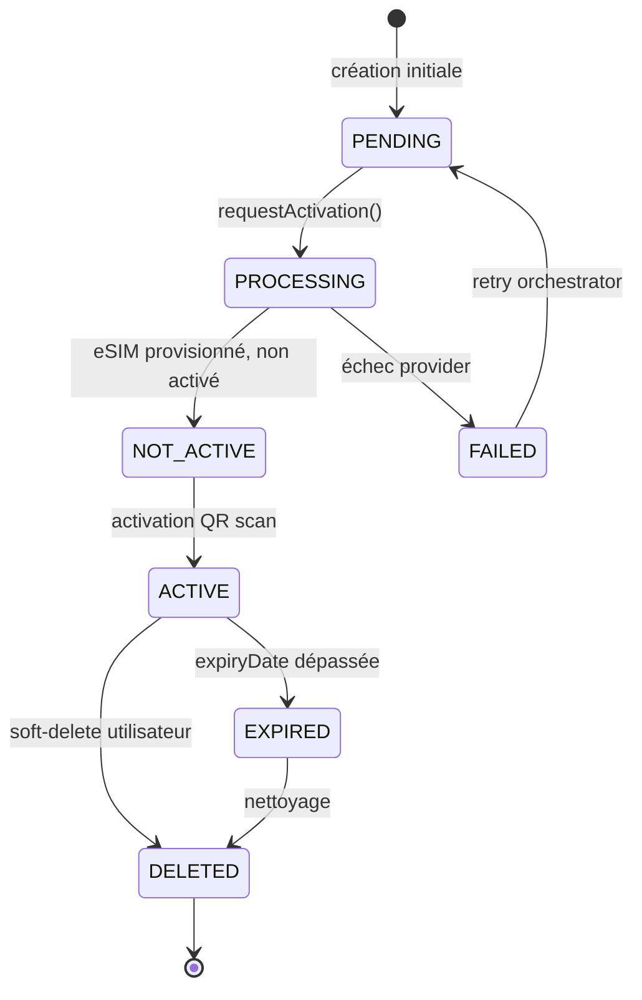

### Wallet State Machine
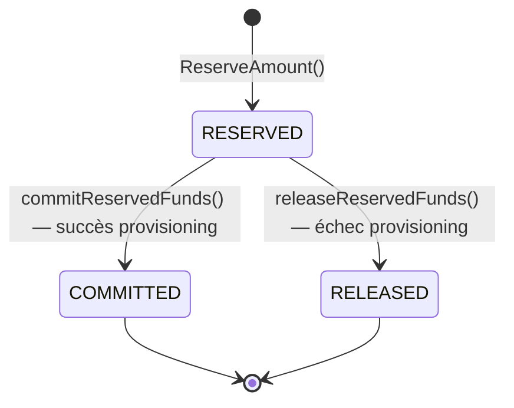

### TopUpRequest State Machine
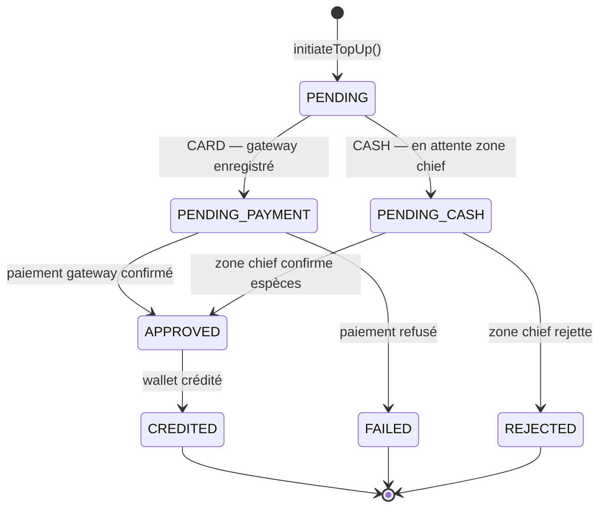
